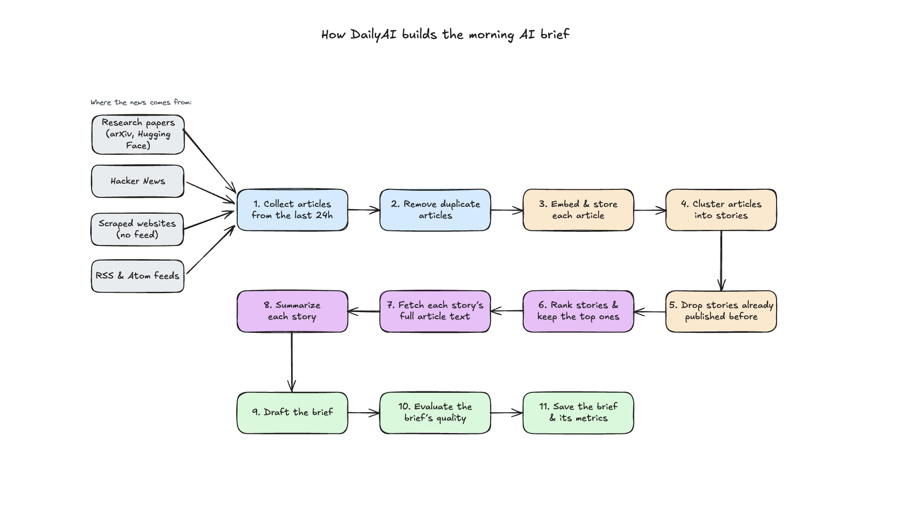

# DailyAI - yesterday's AI news in under 4 minutes

DailyAI ingests AI/tech news from the open web and produces a daily
executive brief - one document, scannable in 2-4 minutes, that leaves the
reader knowing what mattered yesterday in AI. Built for a mixed audience and is simple to read.

## How to run

```bash
cp .env.example .env        # add your keys
uv sync                     # install deps
uv run dailyai              # run pipeline and save the brief
uv run pytest               # run the pipeline tests
```

Or with Docker:

```bash
docker compose -f docker/docker-compose.yml up
```

## How it works



**Steps:**

1. **Collect articles from the last 24h.**

   > Pulls from RSS/Atom feeds, APIs (Hacker News, Hugging Face papers), and
   > a scraper. All feeds are normalized into a shared `Article` format.

2. **Remove duplicate articles.**

   > Drops the same article when it's posted multiple times, by comparing URLs and fuzzy-matching titles.

3. **Embed & store each article.**

   > Captures each article's meaning as a vector embedding
   > and saves it in the database, so it's ready for
   > clustering and reusable later.

4. **Cluster articles into stories.**

   > Groups articles reporting on the same story by looking at how close
   > their embeddings are. The more sources land in one cluster, the more
   > popular the story is. This is a signal that later pushes it rank higher.

5. **Drop stories already published before.**

   > Compares each story's embedding against the stories already covered in
   > recent briefs, and skips it if it's too similar. This way the brief
   > doesn't cover the same ground twice.

6. **Rank stories & keep the top ones.**

   > An LLM orders the stories by importance, using source count,
   > authority, and recency as hints. As a fallback, if that call fails, a
   > rule-based sort on those same metrics is used instead.

7. **Fetch each story's full article text.**

   > Retrieves the full article for each story that was selected.
   > If none available, falls back to the description provided by the source.

8. **Summarize each story.**

   > Each story's article is summarized by LLMs in parallel, turning the
   > full text into the short, factual material the brief will rely on.

9. **Draft the brief.**

   > One LLM call turns the summaries into the finished brief, adding a
   > "why it matters" note and a citation for each story.

10. **Evaluate the brief's quality.**

    > Checks every citation against the real source list, then runs three
    > evaluations: claim support (is each claim traceable to a source),
    > cluster coherence (did clustering merge unrelated stories), and a
    > quality review (scannability, takeaways, jargon).

11. **Save the brief & its metrics.**

    > Writes the finished brief to a markdown file, and stores its
    > evaluation results, quality metrics in the database.

## Example output

See [`briefs/`](briefs/) for a brief generated from a real run.
